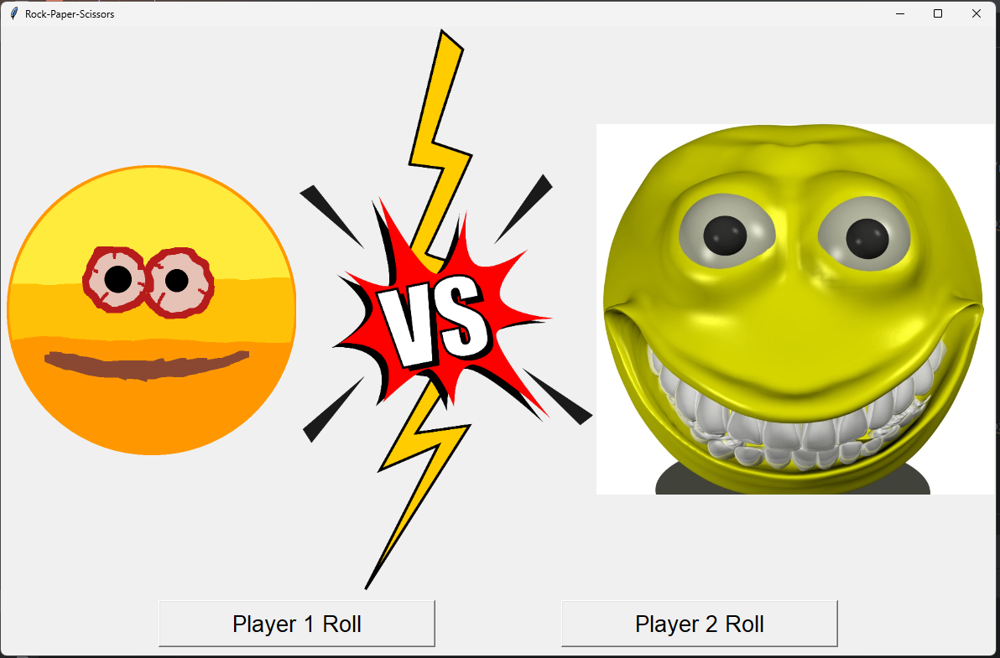
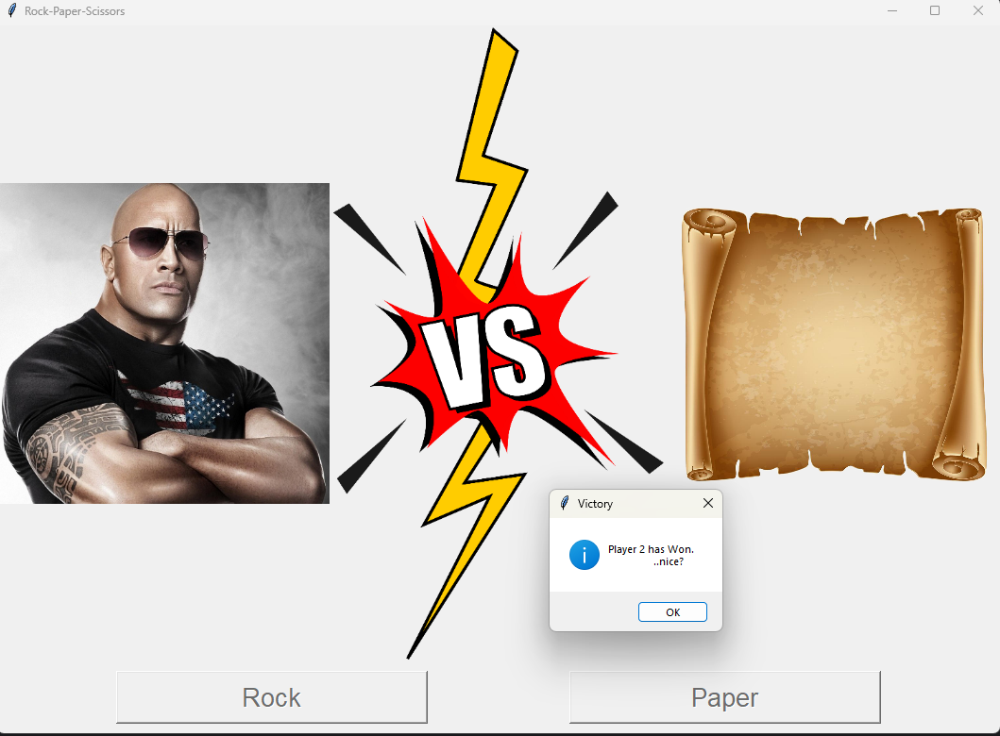
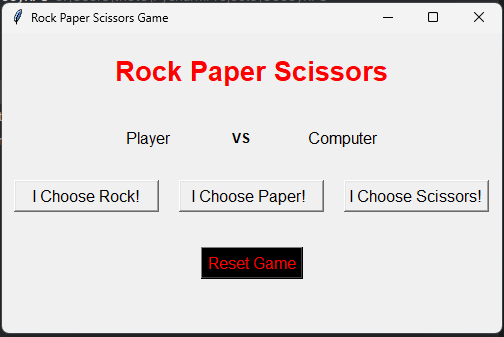
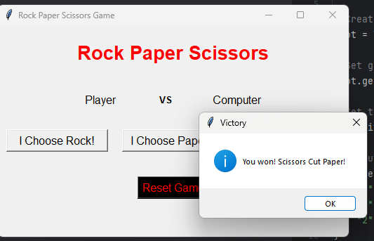

# GooeyRPS - Rock Paper Scissors w/ a lil gui
A project to combine two seperate projects & demonstrate dev flow through integration of a basic feature as an excercise

Idea first came from a simple [geeks for geeks project on GUI applications](https://www.geeksforgeeks.org/create-first-gui-application-using-python-tkinter/) which mentions using the guide to adapt command line python scripts with gui
that i came across after finished the [helloworldprogram's command line rock paper scissors project](https://thehelloworldprogram.com/python/python-game-rock-paper-scissors/) 

The objective is to adapt a basic GUI for the rock paper scissors command line project. 
I will start with just the command line version that i've already completed in VIM as my "main" & use Pycharm & github to develop the "feature" of a GUI using the random library CHOICE funct & tkinter & messagebox for results

### Objectives
- learn github better & get a handle on basic development flow  
- create a project demonstrating my skills/comphrension of python with a silly two player GUI game

### Versions
- There are two versions. RPS_GUI_2P_CURSED is a silly two player version of RPS. This game randomly selects each player's play. This game is meant more as a "Tie" Breaker//Coin flip.
- The second version is a RPS_GUI_SP, this is a single player version that works more like traditional RPS. User selects a play & the program compares that against a random computer/npc selection

## Demos

### Two player in action

### Single Player in Action

